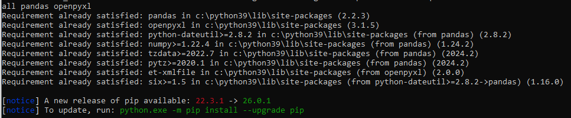

# IPN Agentes Inteligentes
Programas de la materia Agentes Inteligentes Expertos.
---

# **Descripción:**  
Programas realizados para la matería de Agente intelgentes expertos.

---
# Índice


---

## Software necesario.
[Visual Studio Code](https://code.visualstudio.com/) - IDE & Code editor.  

### Librerías
```
Python 3.x  
```
```
pip install pandas 
```
```
pip install pandas openpyxl
```


---
## Contenido

analizador_sentimientos/
│
├── datos/
│   ├── palabras_positivas.txt
│   ├── palabras_negativas.txt
│   └── comentarios.xlsx
│
└── analizador.py
 
## [Analizador de sentimientos]()  


---

## Autor

- GitHub: [AddiTrejo](https://github.com/Additrejo)

---

